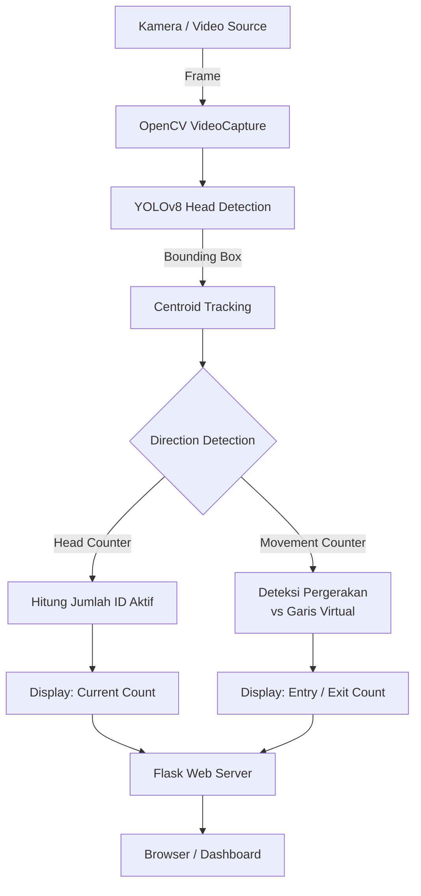
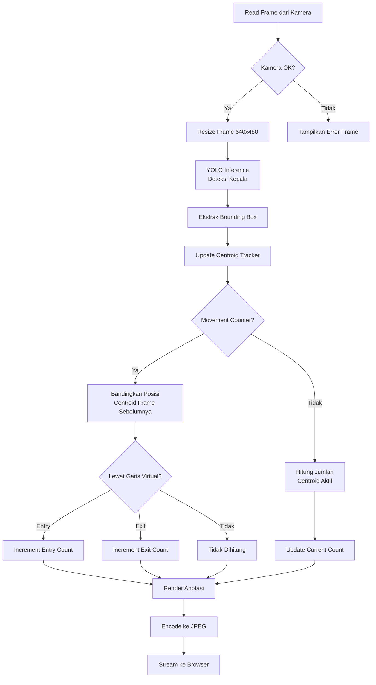
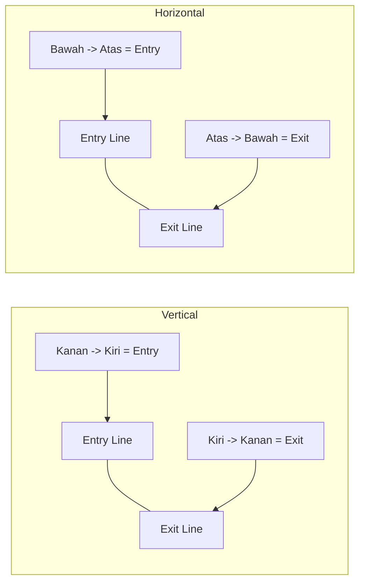

# Cara Kerja Program

## Tech Stack
- Python 3.x
- Flask (web server)
- OpenCV (video capture & rendering)
- YOLOv8 / Ultralytics (head detection)
- openpyxl (export Excel)
- HTML, CSS, JavaScript (frontend dashboard)

## Bahasa Pemrograman
- Python (utama - deteksi, tracking, backend)
- HTML, CSS, JavaScript (frontend dashboard)

## Dua Aplikasi

Proyek ini berisi dua aplikasi independen yang menggunakan pendekatan berbeda:

| Aplikasi | Folder | Metode | Output |
|---|---|---|---|
| **Head Counter** | `src/headcounter/` | Menghitung jumlah kepala dalam frame | Jumlah total pengunjung di area |
| **Movement Counter** | `src/movement_counter/` | Melacak pergerakan melewati garis virtual | Jumlah masuk dan keluar |

## Diagram Blok Sistem



## Diagram Alir Per-Frame



## Komponen Utama

### 1. YOLO Head Detection

Model YOLOv8 dilatih untuk mendeteksi kepala manusia (`class_id=0` pada Head Counter, model khusus pada Movement Counter).
Output dari YOLO berupa bounding box `(x1, y1, x2, y2)` untuk setiap kepala yang terdeteksi.

```
Model Head Counter  : survei2.pt
Model Movement Counter : head.pt
```

### 2. Centroid Tracking

Kedua aplikasi menggunakan algoritma **Centroid Tracking** dengan pendekatan nearest-neighbor:

- Setiap objek yang terdeteksi diberikan ID unik
- Centroid (titik tengah bounding box) dihitung: `cx = (x1 + x2) / 2`, `cy = (y1 + y2) / 2`
- Posisi centroid frame saat ini dicocokkan dengan frame sebelumnya menggunakan Euclidean distance terdekat
- Objek yang tidak muncul selama `max_disappeared` frame akan dihapus
- Objek baru yang muncul didaftarkan dengan ID baru

**Head Counter:**
- `current_count` = jumlah centroid aktif pada frame saat ini
- Tidak ada deteksi arah - murni menghitung jumlah orang

**Movement Counter:**
- Menyimpan posisi sebelumnya tiap objek: `prev_cx` (vertical) atau `prev_cy` (horizontal)
- Membandingkan posisi terhadap garis virtual untuk menentukan arah

### 3. Deteksi Arah (Movement Counter Saja)

**Versi Vertical (Garis Vertikal):**
- Garis entry dan exit ditarik secara vertikal (sejajar sumbu Y)
- Mendeteksi pergerakan horizontal (kiri/kanan)
- Default: bergerak dari **kanan ke kiri** = Entry, **kiri ke kanan** = Exit
- Bisa di-swap via konfigurasi `swap_direction`

**Versi Horizontal (Garis Horizontal):**
- Garis entry dan exit ditarik secara horizontal (sejajar sumbu X)
- Mendeteksi pergerakan vertikal (atas/bawah)
- Default: bergerak dari **bawah ke atas** = Entry, **atas ke bawah** = Exit
- Bisa di-swap via konfigurasi `swap_direction`



### 4. Swap Direction

Fitur `swap_direction` di `config.json` membalik logika arah tanpa mengubah posisi fisik garis:

- Vertical mode normal: **kanan -> kiri** = Entry. Swap: **kiri -> kanan** = Entry
- Horizontal mode normal: **bawah -> atas** = Entry. Swap: **atas -> bawah** = Entry

Saat konfigurasi disimpan dengan swap aktif, nilai `entry_line_position` dan `exit_line_position` ditukar di konfigurasi, sehingga processor tidak perlu tahu apakah sedang di-swap.

### 5. Stabilization Delay (Head Counter)

Head Counter memiliki **stabilization delay 3 detik** saat pertama kali kamera dinyalakan.
Selama periode ini, frame menampilkan countdown dan semua deteksi diabaikan.
Ini mencegah false positive saat kamera baru menyala.