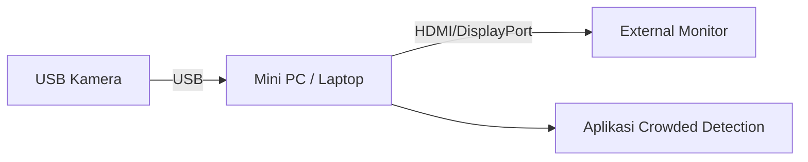
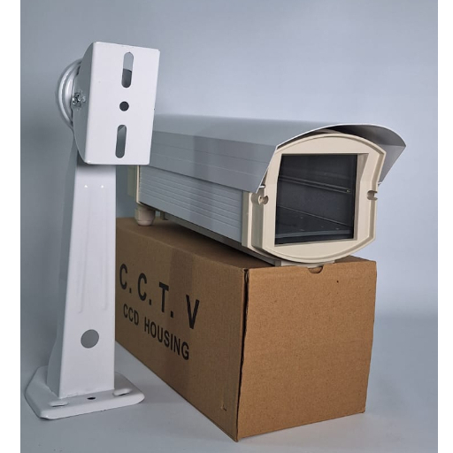
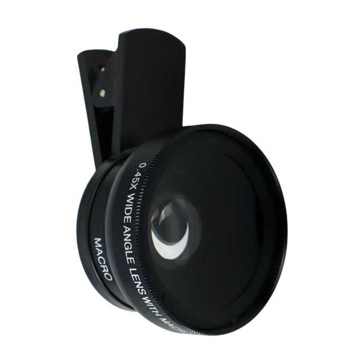

# Cara Setup Perangkat Crowded Detection

## Persiapan Alat
- USB Kamera
- Mini PC / Laptop (OS: Windows 11)
- External Monitor

## Cara Kerja Alat

```
USB Kamera -> Kabel USB -> Mini PC -> Display / Aplikasi
```

### Diagram Blok Versi Langsung



### Catatan untuk Versi 2

Versi "prototype deployment" menggunakan USB Kamera yang terhubung ke modul `USB 2.0 Extender over LAN UTP cable Cat5e/6 RJ45 - 4 USB port - jarak 120 meter` yang dipasangkan pada Housing CCTV (lihat di folder dokumentasi riset). Terdapat pengurangan kualitas video jika menggunakan modul tersebut.

Komponen di dalam Housing CCTV terdiri dari:
- Webcam Logitech C922 atau C270 yang dipasang Lensa Wide 0.45 Clip-On
- USB Extender over Ethernet beserta adapternya
- Keluaran 2 kabel berupa kabel 220V dan kabel ethernet dengan panjang sekitar 20-30m

Pemasangan di dalam housing menggunakan "tape double tip" industri. Namun, karena koneksi USB, tidak ada jaminan bahwa port USB tersebut sering membuat USB kamera tidak terdeteksi.

> [!NOTE]
> Dalam pengujian mitra, terkadang kamera tidak terhubung karena tiang kesenggol atau koneksi di dalam housing kurang rapat. Hal ini bisa diperbaiki dengan membuka housing tersebut dan memastikan koneksi kabel antar komponen. Koneksi yang sering terlepas adalah USB.

### Diagram Blok Versi Deployment


#### USB 2.0 Extender over LAN UTP cable Cat5e/6 RJ45


#### Housing CCTV, Kabel UTP, Lensa Wide Clip-On







---

Note:
- Semua gambar memiliki copyright ke yang punya