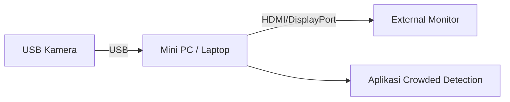

# Setup Perangkat Crowded Detection

## Spesifikasi Perangkat

| Komponen | Spesifikasi |
|---|---|
| Kamera | USB Webcam (Logitech C922 atau C270) |
| Lens | Lensa Wide 0.45 Clip-On |
| Komputasi | Mini PC atau Laptop dengan Windows 11 |
| Display | External Monitor (HDMI/DisplayPort) |
| Konektivitas | USB 2.0, Ethernet (untuk deployment jarak jauh) |

## Arsitektur Sistem

Sistem Crowded Detection menerima input video dari USB Kamera, memprosesnya menggunakan YOLOv8 Head Detection pada Mini PC, dan menampilkan hasilnya pada Display melalui dashboard berbasis web.

```
USB Kamera -> Kabel USB -> Mini PC -> Display / Aplikasi
```

### Konfigurasi Langsung

Pada konfigurasi ini, kamera terhubung langsung ke Mini PC melalui kabel USB tanpa perantara.



### Konfigurasi Deployment (Jarak Jauh)

Konfigurasi ini digunakan untuk deployment di lapangan di mana kamera ditempatkan pada jarak 20-30 meter dari unit komputasi. Koneksi diperpanjang menggunakan modul **USB 2.0 Extender over LAN UTP Cat5e/6 RJ45** dengan kapasitas 4 port USB dan jangkauan hingga 120 meter.

> [!WARNING]
> Penggunaan modul USB Extender dapat menyebabkan penurunan kualitas video.


#### Komponen Housing CCTV

Housing CCTV berisi komponen-komponen berikut:

- Webcam Logitech C922 atau C270 dengan Lensa Wide 0.45 Clip-On terpasang
- Modul USB Extender over Ethernet (TX) beserta adaptor daya
- Dua kabel keluar: kabel daya 220V dan kabel Ethernet UTP (panjang 20-30 meter)

Komponen dipasang di dalam housing menggunakan perekat double-tape industri. Namun demikian, koneksi USB pada modul extender rentan terlepas akibat getaran atau gangguan fisik, yang dapat menyebabkan kamera tidak terdeteksi oleh sistem.

> [!NOTE]
> Dalam pengujian di lokasi mitra, kamera dapat terputus akibat gangguan fisik pada tiang atau koneksi di dalam housing yang longgar. Penanganan dilakukan dengan membuka housing dan memastikan seluruh koneksi kabel terpasang dengan baik. Koneksi USB merupakan titik yang paling sering mengalami masalah.

#### Referensi Foto Komponen (Rekomendasi: Lihat Dokumentasi di Folder Crowded Detection)

**USB 2.0 Extender over LAN UTP Cat5e/6 RJ45:**


**Housing CCTV, Kabel UTP, dan Lensa Wide Clip-On:**


---

Seluruh gambar merupakan hak cipta pemiliknya masing-masing.